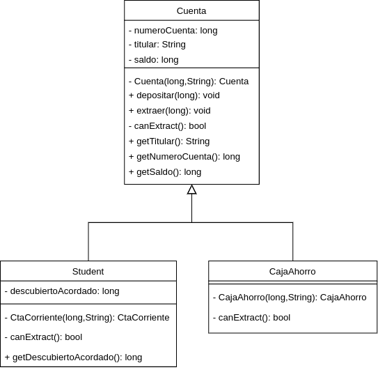

# i.
No me parece que esta clase esté correctamente diseñada.
Para comenzar, una Cuenta siempre es una CAJA_AHORRO o una CTA_CORRIENTE, no percibo que exista algo concreto que sea una cuenta. Con lo cual, una Cuenta, puede ser una abstracción que tenga comportamientos similares que compartan CAJA_AHORRO y CTA_CORRIENTE y luego estas ser clases concretas con sus comportamientos específicos.

Por otro lado, existen 2 constructores muy similares y peor aun, el segundo me deja crear una CTA_CORRIENTE con descubiertoAcordado = 0, que no creo que tenga algún sentido de negocio.

A continuación propongo un esquema que me parece más correcto.

# ii.




```Java
abstract class Cuenta {
    protected long numeroCuenta;
    protected String titular;
    protected long saldo;

    private Cuenta(long nCuenta, String titular) {
        this.numeroCuenta = nCuenta;
        this.titular = titular;
        this.saldo = 0;
    }

    public void depositar(long monto) {
        this.saldo += monto;
    }

    protected abstract bool canExtract(long monto);

    public void extraer(long monto) throws RuntimeException{
        if (this.cantExtract()) throw new RuntimeException("No hay dinero suficiente");
        saldo -= monto;
    }

    public String getTitular(){
        return this.titular;
    }

    public long getNumeroCuenta(){
        return this.numeroCuenta;
    }

    public long getSaldo(){
        return this.saldo;
    }
}
```

```Java
public class CajaAhorro extends Cuenta {
    private CajaAhorro(long nCuenta, String titular) {
        super(ncuenta, titular);
    }

    @Override
    protected bool canExtract(long monto) {
        return (monto > this.saldo);
    }
}
```

```Java
public class CajaAhorro extends Cuenta {
    protected long descubiertoAcordado;

    private CtaCorriente(long nCuenta, String titular, long descAcordado) {
        super(ncuenta, titular);
        this.descubiertoAcordado = descAcordado;
    }

    @Override
    protected bool canExtract(long monto) {
        return (monto > this.saldo + this.descubiertoAcordado);
    }

    public long getDescubiertoAcordado(){
        return this.descubiertoAcordado;
    }
}
```

# iii.
Estoy definiendo nuevas clases y modificando los constructores originales, con lo cual hay que revisar el código y adaptarlo a esta nueva estructura, pero no tiene por qué ser muy complicado de realizar el cambio.
La mayoría de los IDEs proveen herramientas de refactoring que facilitan la modificación del código.
Para introducir los cambios, una opción es definir una gran batería de tests antes de realizar los cambios para poder verificar luego de su introducción que no haya agregado bugs al código.

# iv.
Necesito agregar getters para conocer datos relevantes como el saldo, el titular y número de cuenta.
No está definido el modelo de negocios, pero es razonable asumir que tanto el titular como el numero de cuenta no deberían modificarse.
Para el saldo me alcanzan las funciones extraer y depositar para manipularlo.
Con el descubierto necesito definirle su getter correspondiente y habría que ver si necesito poder modificarlo.

# v.
Sí, utilizo el patrón de diseño Template Method, el cual utilizo para modificar o extender el comportamiento de ciertos metodos dependiendo de su clase.